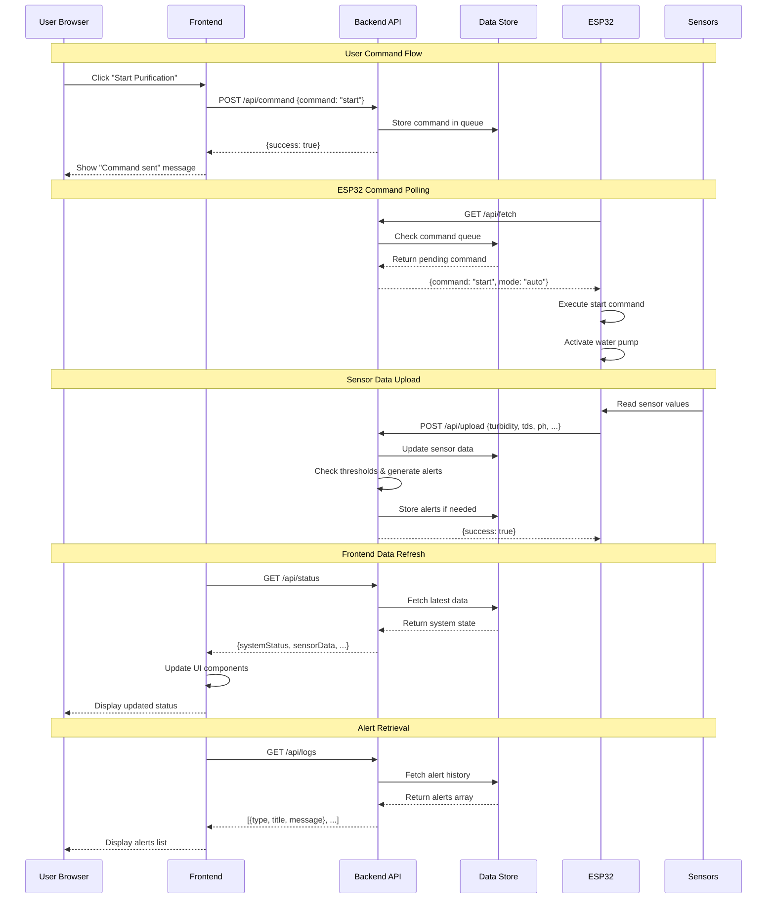
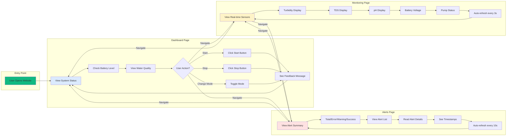
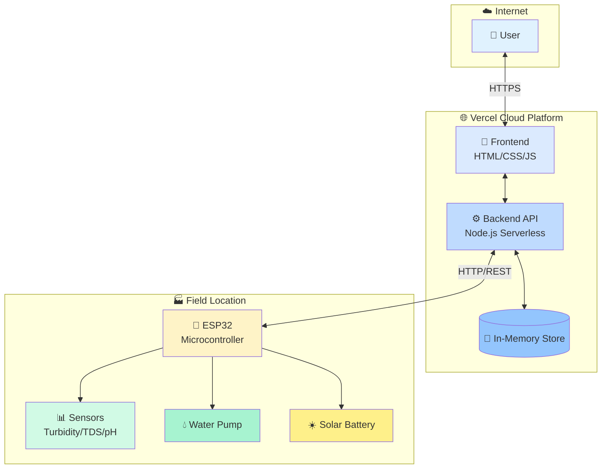
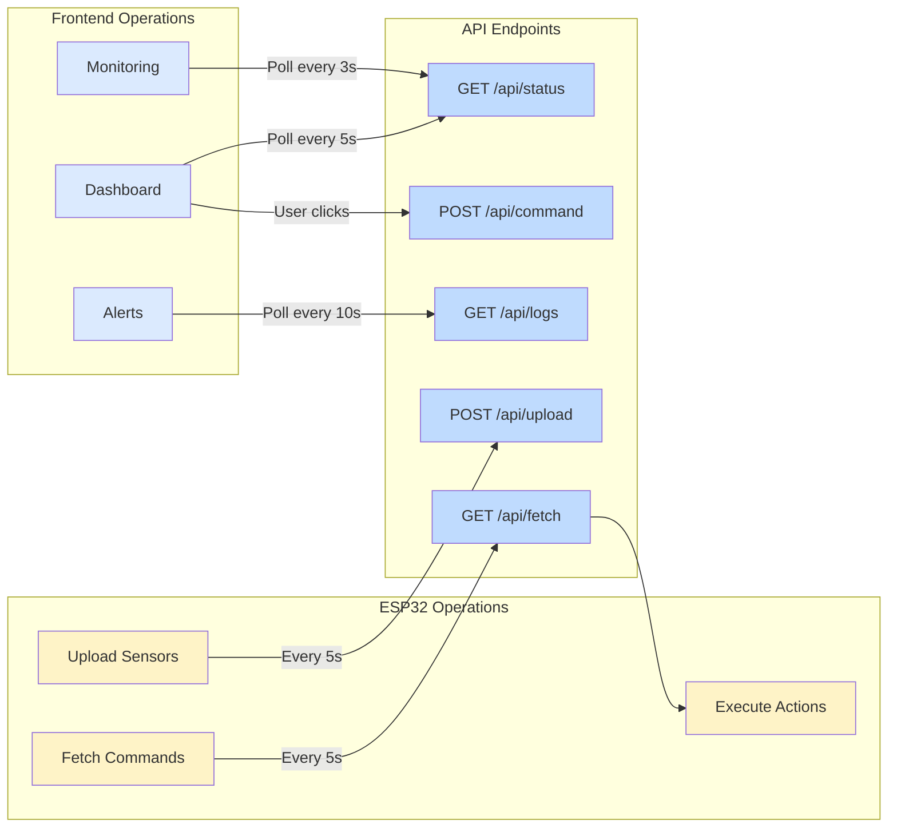

# System Diagrams - Smart Solar Water Purification System

## 1. Block Diagram

```mermaid
graph TB
    subgraph "User Interface Layer"
        A[Web Browser]
        A1[Dashboard Page]
        A2[Monitoring Page]
        A3[Alerts Page]
        A --> A1
        A --> A2
        A --> A3
    end
    
    subgraph "Cloud Infrastructure - Vercel"
        B[Frontend Static Files]
        C[Backend API<br/>Serverless Functions]
        C1[/api/status]
        C2[/api/command]
        C3[/api/logs]
        C4[/api/upload]
        C5[/api/fetch]
        C --> C1
        C --> C2
        C --> C3
        C --> C4
        C --> C5
        D[In-Memory Data Store]
        C1 -.-> D
        C2 -.-> D
        C3 -.-> D
        C4 -.-> D
        C5 -.-> D
    end
    
    subgraph "IoT Hardware Layer"
        E[ESP32 Microcontroller]
        E1[Wi-Fi Module]
        E --> E1
    end
    
    subgraph "Sensor Layer"
        F1[Turbidity Sensor]
        F2[TDS Sensor]
        F3[pH Sensor]
        F4[Water Level Sensor]
        F5[Voltage Sensor]
    end
    
    subgraph "Actuator Layer"
        G1[Water Pump]
        G2[Solar Battery]
    end
    
    A1 -->|HTTP Requests| B
    A2 -->|HTTP Requests| B
    A3 -->|HTTP Requests| B
    B -->|API Calls| C
    E1 <-->|HTTP/REST| C
    E --> F1
    E --> F2
    E --> F3
    E --> F4
    E --> F5
    E --> G1
    E --> G2
    
    style A fill:#e0f2fe
    style B fill:#dbeafe
    style C fill:#bfdbfe
    style D fill:#93c5fd
    style E fill:#fef3c7
    style A1 fill:#f0f9ff
    style A2 fill:#f0f9ff
    style A3 fill:#f0f9ff
```

---

## 2. Data Flow Diagram



---

## 3. User Interface Flow



---

## 4. System Architecture Overview



---

## 5. API Communication Pattern



---

## Diagram Explanations

### Block Diagram
Shows the **physical and logical components** of the system:
- **User Interface Layer**: Web pages users interact with
- **Cloud Infrastructure**: Vercel hosting (frontend + backend)
- **IoT Hardware**: ESP32 microcontroller
- **Sensors**: Data collection devices
- **Actuators**: Control devices (pump, battery)

### Data Flow Diagram
Shows **how data moves** through the system:
1. User sends commands → Backend stores → ESP32 fetches
2. Sensors read data → ESP32 uploads → Backend stores
3. Frontend polls → Backend returns → UI updates
4. Alerts generated automatically based on thresholds

### User Interface Flow
Shows **user navigation** through the application:
- Dashboard: Control and status overview
- Monitoring: Real-time sensor data
- Alerts: Notification history
- Each page auto-refreshes at different intervals

### System Architecture Overview
Shows **high-level system design**:
- User connects via internet
- Vercel hosts both frontend and backend
- ESP32 in field location communicates with cloud
- Sensors and actuators controlled by ESP32

### API Communication Pattern
Shows **API usage patterns**:
- Frontend polls different endpoints at different rates
- ESP32 uploads data and fetches commands periodically
- Clear separation between user-facing and device-facing APIs
